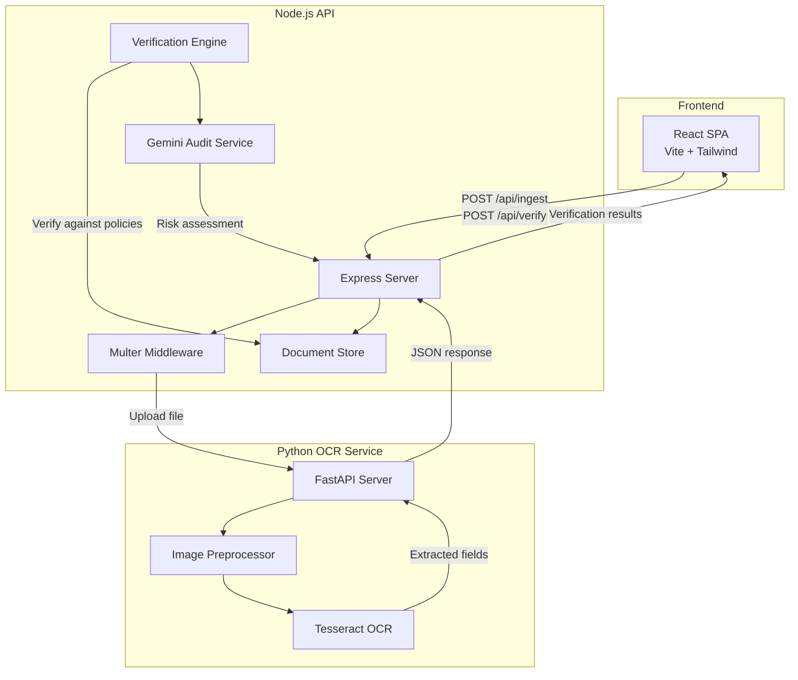
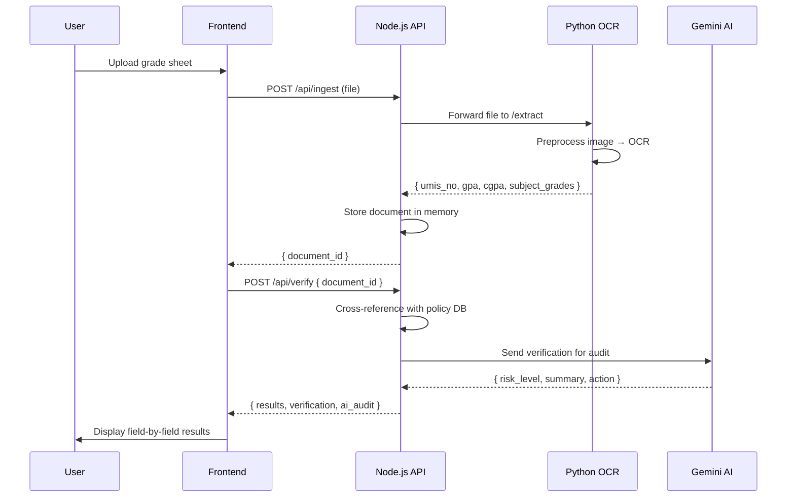

<!-- ============================================================ -->
<!--  HERO SECTION                                                -->
<!-- ============================================================ -->
<div align="center">

  

  <h1>AuthDoc</h1>
  <p><b>A verification-first document intelligence platform that extracts, validates, and audits academic records against institutional databases — powered by OCR and AI.</b></p>

  <br />

  <a href="https://github.com/your-org/AuthDoc_UI/actions"></a>
  <a href="https://github.com/your-org/AuthDoc_UI/blob/main/LICENSE"></a>
  <a href="https://github.com/your-org/AuthDoc_UI/releases"></a>
  <a href="https://github.com/your-org/AuthDoc_UI/issues"></a>

  <br /><br />

  
  
  
  
  
  

</div>

<br />

<!-- ============================================================ -->
<!--  KEY METRICS DASHBOARD                                        -->
<!-- ============================================================ -->

<table align="center" border="0" cellpadding="12" cellspacing="0" width="100%">
  <tr>
    <td align="center" width="25%">
      <br/>
      <sub>SPA · Tailwind · shadcn/ui</sub>
    </td>
    <td align="center" width="25%">
      <br/>
      <sub>REST · Multer · CORS</sub>
    </td>
    <td align="center" width="25%">
      <br/>
      <sub>Tesseract · OpenCV · PIL</sub>
    </td>
    <td align="center" width="25%">
      <br/>
      <sub>Risk analysis · Fallback</sub>
    </td>
  </tr>
</table>

<br />

---

<br />

<!-- ============================================================ -->
<!--  TABLE OF CONTENTS                                           -->
<!-- ============================================================ -->

## Table of Contents

<details>
<summary><b>Click to expand full navigation</b></summary>

- [Overview](#-overview)
- [Features](#-features)
- [System Architecture](#-system-architecture)
- [Tech Stack](#-tech-stack)
- [Directory Structure](#-directory-structure)
- [Prerequisites](#-prerequisites)
- [Quickstart](#-quickstart)
- [Configuration](#-configuration)
- [API Reference](#-api-reference)
- [Usage Examples](#-usage-examples)
- [Deployment](#-deployment)
- [Contributing](#-contributing)

</details>

<br />

---

<br />

<!-- ============================================================ -->
<!--  OVERVIEW                                                    -->
<!-- ============================================================ -->

## Overview

**AuthDoc** is a full-stack academic document verification platform built for institutions that need to validate student grade sheets against their official databases. It combines OCR extraction (Tesseract), rules-based verification, and AI-powered risk auditing to deliver a complete trust pipeline for academic records.

**How it works:**

1. **Upload** — Students or administrators submit grade sheets as PDF or image files.
2. **Extract** — Tesseract OCR (via Python/FastAPI) pulls structured data: UMIS numbers, GPA, CGPA, and per-subject grades.
3. **Verify** — The Node.js backend cross-references extracted data against a configurable institutional policy database.
4. **Audit** — Google Gemini provides a natural-language risk assessment (or a local heuristic fallback when no API key is configured).

The result is a clear, field-by-field verification report with full explainability — every field shows its extracted value, verification status (`VERIFIED`, `FLAGGED`, or `MISSING`), and the reason for that status.

<br />

---

<br />

<!-- ============================================================ -->
<!--  FEATURES                                                    -->
<!-- ============================================================ -->

## Features

<table border="0" cellpadding="8" cellspacing="0" width="100%">
  <tr>
    <td width="50%" valign="top">

**Core Capabilities**
- Single & batch document upload
- OCR extraction with image preprocessing
- Rules-based grade verification
- AI-powered risk audit (Gemini)
- Full field-level explainability

    </td>
    <td width="50%" valign="top">

**Engineering Highlights**
- Zero-dependency in-memory document store
- Graceful AI fallback when API unavailable
- Strict file-type & size validation (Multer)
- CORS-configurable origins
- Structured error responses

    </td>
  </tr>
</table>

<br />

---

<br />

<!-- ============================================================ -->
<!--  SYSTEM ARCHITECTURE                                         -->
<!-- ============================================================ -->

## System Architecture



### Data Flow



<br />

---

<br />

<!-- ============================================================ -->
<!--  TECH STACK                                                  -->
<!-- ============================================================ -->

## Tech Stack

| Layer | Technology | Purpose |
| :--- | :--- | :--- |
| **Frontend** | React 18, TypeScript, Vite, Tailwind CSS, shadcn/ui | SPA with component library, routing, reactive state |
| **API Gateway** | Node.js, Express 4, Multer | REST endpoints, file upload, CORS, error handling |
| **OCR Engine** | Python 3, FastAPI, Tesseract, OpenCV, PIL | Document image preprocessing and field extraction |
| **AI Audit** | Google Gemini 1.5 Flash | Natural language risk assessment with JSON fallback |
| **Dev Tooling** | Vite, ESLint, Vitest, Prettier | Hot reload, linting, unit testing, formatting |

<br />

---

<br />

<!-- ============================================================ -->
<!--  DIRECTORY STRUCTURE                                         -->
<!-- ============================================================ -->

## Directory Structure

<details>
<summary><b>Click to expand full file tree</b></summary>

```text
AuthDoc_UI/
├── frontend/                          # React SPA
│   ├── public/                        # Static assets
│   ├── src/
│   │   ├── components/                # Reusable UI components
│   │   │   ├── ui/                    # shadcn/ui primitives
│   │   │   ├── Header.tsx
│   │   │   ├── Footer.tsx
│   │   │   ├── FileUploadZone.tsx
│   │   │   ├── StatusBadge.tsx
│   │   │   └── ...
│   │   ├── pages/                     # Route-level views
│   │   │   ├── Index.tsx              # Landing page
│   │   │   ├── UploadPage.tsx         # Document upload
│   │   │   ├── ResultsPage.tsx        # Batch results
│   │   │   ├── DetailPage.tsx         # Single doc detail
│   │   │   └── NotFound.tsx
│   │   ├── lib/
│   │   │   ├── api.ts                 # API client layer
│   │   │   └── utils.ts
│   │   ├── hooks/                     # Custom React hooks
│   │   ├── App.tsx                    # Router entry
│   │   ├── main.tsx                   # DOM mount
│   │   └── index.css                  # Design system tokens
│   ├── tailwind.config.ts
│   ├── vite.config.ts
│   ├── package.json
│   └── .env.example
│
├── backend/
│   ├── node/                          # Express API server
│   │   ├── src/
│   │   │   ├── config/
│   │   │   │   └── policies.json      # Verification policy DB
│   │   │   ├── controllers/
│   │   │   │   └── verify.controller.js
│   │   │   ├── middleware/
│   │   │   │   └── upload.middleware.js
│   │   │   ├── routes/
│   │   │   │   └── verify.routes.js
│   │   │   ├── services/
│   │   │   │   ├── verifier.service.js
│   │   │   │   ├── pythonClient.js
│   │   │   │   └── aiAuditService.js
│   │   │   ├── store/
│   │   │   │   └── documentStore.js
│   │   │   ├── app.js
│   │   │   └── server.js
│   │   ├── package.json
│   │   └── .env.example
│   │
│   └── python/                        # FastAPI OCR service
│       ├── main.py                    # FastAPI app entry
│       ├── extractor.py               # Tesseract + OpenCV pipeline
│       ├── requirements.txt
│       └── .env.example
│
├── README.md
├── CONTRIBUTING.md
├── .gitignore
└── .env.example
```

</details>

<br />

---

<br />

<!-- ============================================================ -->
<!--  PREREQUISITES                                               -->
<!-- ============================================================ -->

## Prerequisites

| Requirement | Version | Notes |
| :--- | :--- | :--- |
| **Node.js** | `>=18.0.0` | LTS recommended |
| **pnpm** | `>=8.0.0` | Package manager (see `packageManager` in package.json) |
| **Python** | `>=3.10` | Required for OCR service |
| **Tesseract OCR** | `>=5.0` | Must be installed locally or via system package manager |
| **Git** | `>=2.30` | Version control |

> [!IMPORTANT]
> Tesseract OCR binary must be accessible at the path configured in `backend/python/extractor.py` or via the `TESSERACT_CMD` environment variable. On Windows, download from [UB-Mannheim/tesseract](https://github.com/UB-Mannheim/tesseract/wiki).

<br />

---

<br />

<!-- ============================================================ -->
<!--  QUICKSTART                                                  -->
<!-- ============================================================ -->

## Quickstart

### 1. Clone the Repository

```bash
git clone https://github.com/your-org/AuthDoc_UI.git
cd AuthDoc_UI
```

### 2. Start the Python OCR Service

```bash
cd backend/python

# Create virtual environment
python -m venv .venv

# Activate (Windows)
.venv\Scripts\activate

# Activate (macOS/Linux)
source .venv/bin/activate

# Install dependencies
pip install -r requirements.txt

# Copy and configure environment variables
cp .env.example .env

# Start the server
uvicorn main:app --host 127.0.0.1 --port 8000 --reload
```

### 3. Start the Node.js API Server

```bash
cd backend/node

# Install dependencies
pnpm install

# Copy and configure environment variables
cp .env.example .env

# Start the development server
pnpm dev
```

### 4. Start the Frontend

```bash
cd frontend

# Install dependencies
pnpm install

# Copy and configure environment variables
cp .env.example .env

# Start the dev server
pnpm dev
```

### 5. Open in Browser

Navigate to **http://localhost:8080** to access the AuthDoc UI.

> [!TIP]
> All three services must be running simultaneously for full functionality. The frontend (port 8080) talks to Node.js API (port 3000), which forwards uploads to Python OCR (port 8000).

<br />

---

<br />

<!-- ============================================================ -->
<!--  CONFIGURATION                                               -->
<!-- ============================================================ -->

## Configuration

### Node.js Backend (`backend/node/.env.example`)

| Variable | Default | Description |
| :--- | :--- | :--- |
| `PORT` | `3000` | Server listen port |
| `PYTHON_OCR_URL` | `http://127.0.0.1:8000/extract` | Python OCR endpoint |
| `GEMINI_API_KEY` | _(empty)_ | Google Gemini API key for AI audit |
| `GEMINI_MODEL` | `gemini-1.5-flash` | Gemini model identifier |
| `CORS_ORIGINS` | `http://localhost:8080` | Comma-separated allowed origins |
| `MAX_FILE_SIZE_MB` | `10` | Max upload size per file |
| `MAX_FILES_PER_BATCH` | `10` | Max files in batch upload |

### Python OCR Service (`backend/python/.env.example`)

| Variable | Default | Description |
| :--- | :--- | :--- |
| `PORT` | `8000` | Server listen port |
| `HOST` | `127.0.0.1` | Bind address |
| `TESSERACT_CMD` | _(system default)_ | Path to Tesseract binary |
| `LOG_LEVEL` | `INFO` | Logging verbosity |

### Frontend (`frontend/.env.example`)

| Variable | Default | Description |
| :--- | :--- | :--- |
| `VITE_API_BASE_URL` | `http://localhost:3000/api` | Node.js API base URL |

> [!NOTE]
> The frontend reads `API_BASE_URL` from `src/lib/api.ts`. For production builds, update the constant or inject via Vite's `import.meta.env` pattern.

<br />

---

<br />

<!-- ============================================================ -->
<!--  API REFERENCE                                               -->
<!-- ============================================================ -->

## API Reference

All endpoints are prefixed with `/api` on the Node.js server (default port 3000).

### Ingest

| Method | Endpoint | Body | Response |
| :--- | :--- | :--- | :--- |
| `POST` | `/api/ingest` | `multipart/form-data` with `file` field | `{ document_id }` |
| `POST` | `/api/ingest/batch` | `multipart/form-data` with `files[]` field | `{ count, documents: [{ document_id }] }` |

**Constraints:**
- File types: `application/pdf`, `image/jpeg`, `image/png`
- Max file size: 10 MB
- Max batch size: 10 files

### Verify

| Method | Endpoint | Body | Response |
| :--- | :--- | :--- | :--- |
| `POST` | `/api/verify` | `{ document_id, policy_id? }` | `{ document_id, results, verification, ai_audit }` |
| `POST` | `/api/verify/batch` | `{ document_ids: string[], policy_id? }` | `{ candidates: [{ document_id, overall_status }] }` |

### Verification Statuses

| Status | Meaning |
| :--- | :--- |
| `VERIFIED` | All extracted fields match institutional records |
| `FLAGGED` | One or more fields mismatch or are not in the database |
| `MISSING` | Required data (e.g., UMIS number) was not extracted |

<br />

---

<br />

<!-- ============================================================ -->
<!--  USAGE EXAMPLES                                              -->
<!-- ============================================================ -->

## Usage Examples

### Upload a Single Document

```bash
curl -X POST http://localhost:3000/api/ingest \
  -F "file=@grade_sheet.pdf"
```

**Response:**
```json
{
  "document_id": "a1b2c3d4-e5f6-7890-abcd-ef1234567890"
}
```

### Verify a Document

```bash
curl -X POST http://localhost:3000/api/verify \
  -H "Content-Type: application/json" \
  -d '{"document_id": "a1b2c3d4-e5f6-7890-abcd-ef1234567890"}'
```

**Response:**
```json
{
  "document_id": "a1b2c3d4-e5f6-7890-abcd-ef1234567890",
  "results": {
    "gpa": { "value": 8.5, "status": "VERIFIED", "reason": "All subjects match institutional records" },
    "cgpa": { "value": 8.2, "status": "VERIFIED", "reason": "All subjects match institutional records" },
    "umis_no": { "value": "2403732210421149", "status": "VERIFIED", "reason": "UMIS extracted" }
  },
  "verification": {
    "overall_status": "VERIFIED",
    "reason": "All subjects match institutional records"
  },
  "ai_audit": {
    "risk_level": "Low",
    "summary": "Document verified successfully with no discrepancies.",
    "key_issues": "None",
    "recommended_action": "No action required."
  }
}
```

### Batch Upload & Verify (Frontend Flow)

```typescript
import { uploadAndVerifyBatch } from '@/lib/api';

const files: File[] = [/* selected files */];
const results = await uploadAndVerifyBatch(files, 'strict', (current, total) => {
  console.log(`Uploaded ${current}/${total}`);
});
console.log(results.candidates);
```

<br />

---

<br />

<!-- ============================================================ -->
<!--  DEPLOYMENT                                                  -->
<!-- ============================================================ -->

## Deployment

### Docker

```dockerfile
# Multi-stage build example (Node.js backend)
FROM node:20-alpine AS builder
WORKDIR /app
COPY backend/node/package.json backend/node/pnpm-lock.yaml ./
RUN corepack enable && pnpm install --frozen-lockfile
COPY backend/node/src ./src
EXPOSE 3000
CMD ["node", "src/server.js"]
```

### Environment Variables for Production

> [!IMPORTANT]
> Never commit `.env` files to version control. In production, inject environment variables via:
> - Docker: `--env-file .env` or `docker-compose` secrets
> - Cloud Run / GKE: Secret Manager or ConfigMap
> - CI/CD: GitHub Actions secrets or equivalent

<br />

---

<br />

<!-- ============================================================ -->
<!--  CONTRIBUTING                                                -->
<!-- ============================================================ -->

## Contributing

We welcome contributions! Please see [CONTRIBUTING.md](./CONTRIBUTING.md) for guidelines on:

- Setting up the development environment
- Code style and linting rules
- Branch naming conventions
- Pull request process

<br />

---

<br />

<div align="center">
  <sub>Built with care by the AuthDoc team · 2025</sub>
</div>
