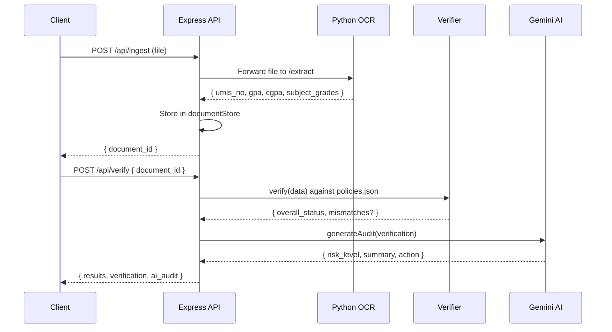

<!-- ============================================================ -->
<!--  AUTHDOC NODE.JS BACKEND — README                             -->
<!-- ============================================================ -->
<div align="center">

  <h1>AuthDoc Node.js Backend</h1>
  <p><b>Express API server handling document ingestion, verification, and AI-powered audit.</b></p>

  <a href="https://expressjs.com/"></a>
  <a href="https://nodejs.org/"></a>
  <a href="https://www.typescriptlang.org/"></a>

</div>

<br />

---

<br />

## Overview

The Node.js backend is the **orchestration layer** of AuthDoc. It receives document uploads, forwards them to the Python OCR service for extraction, stores results in memory, runs rules-based verification against a policy database, and generates AI-powered risk assessments via Google Gemini.

### Responsibilities

| Component | Role |
| :--- | :--- |
| Express server | REST endpoints, CORS, JSON parsing |
| Multer middleware | File upload validation (type, size) |
| Verifier service | Rules-based grade verification against `policies.json` |
| Python client | Forwards uploaded files to the OCR service |
| AI audit service | Gemini-powered risk assessment with local fallback |
| Document store | In-memory document cache (no DB required) |
| Logger middleware | Structured JSON logging |
| Security middleware | HTTP security headers |

<br />

---

<br />

## Directory Structure

```text
backend/node/
├── src/
│   ├── config/
│   │   └── policies.json          # Verification policy database
│   ├── controllers/
│   │   └── verify.controller.js   # Request handlers
│   ├── middleware/
│   │   ├── upload.middleware.js    # Multer file validation
│   │   ├── logger.middleware.js    # Structured JSON logging
│   │   └── security.middleware.js  # HTTP security headers
│   ├── routes/
│   │   └── verify.routes.js       # Route definitions
│   ├── services/
│   │   ├── verifier.service.js    # Verification engine
│   │   ├── pythonClient.js        # OCR service client
│   │   └── aiAuditService.js      # Gemini AI audit
│   ├── store/
│   │   └── documentStore.js       # In-memory document cache
│   ├── app.js                     # Express app setup
│   └── server.js                  # Server entry point
├── Dockerfile
├── .dockerignore
├── .env.example
├── nodemon.json
├── package.json
└── package-lock.json
```

<br />

---

<br />

## Quickstart

### Local Development

```bash
cd backend/node

# Install dependencies
pnpm install

# Configure environment
cp .env.example .env
# Edit .env with your settings

# Start with hot-reload
pnpm dev
```

Server runs at `http://localhost:3000`.

### Docker

```bash
# Build image
docker build -t authdoc-api .

# Run container
docker run -p 3000:3000 \
  -e PYTHON_OCR_URL=http://host.docker.internal:8000/extract \
  -e CORS_ORIGINS=http://localhost:8080 \
  authdoc-api
```

### Docker Compose (recommended)

From the project root:

```bash
docker compose up api
```

<br />

---

<br />

## Environment Variables

| Variable | Default | Required | Description |
| :--- | :--- | :--- | :--- |
| `PORT` | `3000` | No | Server listen port |
| `NODE_ENV` | `development` | No | `production` enables security headers and HSTS |
| `PYTHON_OCR_URL` | `http://127.0.0.1:8000/extract` | Yes | Python OCR service endpoint |
| `GEMINI_API_KEY` | _(empty)_ | No | Google Gemini API key (falls back to local heuristic) |
| `GEMINI_MODEL` | `gemini-1.5-flash` | No | Gemini model identifier |
| `CORS_ORIGINS` | `http://localhost:8080` | No | Comma-separated allowed origins |
| `LOG_LEVEL` | `INFO` | No | Logging verbosity: `DEBUG`, `INFO`, `WARN`, `ERROR` |
| `MAX_FILE_SIZE_MB` | `10` | No | Max upload size per file |
| `MAX_FILES_PER_BATCH` | `10` | No | Max files in batch upload |

<br />

---

<br />

## API Endpoints

### Health Checks

| Method | Endpoint | Response |
| :--- | :--- | :--- |
| GET | `/healthz` | `{ "status": "ok", "uptime": 12345 }` |
| GET | `/readyz` | `{ "status": "ready" }` |

### Ingest

| Method | Endpoint | Body | Response |
| :--- | :--- | :--- | :--- |
| POST | `/api/ingest` | `multipart/form-data` (`file`) | `{ document_id }` |
| POST | `/api/ingest/batch` | `multipart/form-data` (`files[]`) | `{ count, documents: [{ document_id }] }` |

**Constraints:**
- Allowed types: `application/pdf`, `image/jpeg`, `image/png`
- Max file size: 10 MB
- Max batch: 10 files

### Verify

| Method | Endpoint | Body | Response |
| :--- | :--- | :--- | :--- |
| POST | `/api/verify` | `{ document_id, policy_id? }` | `{ document_id, results, verification, ai_audit }` |
| POST | `/api/verify/batch` | `{ document_ids: string[] }` | `{ candidates: [{ document_id, overall_status }] }` |

<br />

---

<br />

## Verification Flow



<br />

---

<br />

## Policy Database

Policies are defined in `src/config/policies.json`. Each entry maps a UMIS number to expected student data:

```json
{
  "UMIS_NUMBER": {
    "student_name": "STUDENT NAME",
    "subjects": {
      "SUBJECT_CODE": "EXPECTED_GRADE"
    }
  }
}
```

The verifier engine compares OCR-extracted subjects against this database and returns per-subject mismatches.

<br />

---

<br />

## Production Notes

- **Health checks**: `/healthz` and `/readyz` endpoints are configured for Docker and Cloud Run probes
- **Graceful shutdown**: Handles `SIGTERM` and `SIGINT` with a 10s timeout
- **Structured logging**: All requests and errors are logged as JSON to stdout/stderr
- **Security headers**: X-Content-Type-Options, X-Frame-Options, HSTS (production), etc.
- **CORS**: Configurable via `CORS_ORIGINS` environment variable
- **AI fallback**: When `GEMINI_API_KEY` is empty, uses a local heuristic audit

<br />

---

<br />

<div align="center">
  <sub>Part of the <a href="../README.md">AuthDoc</a> platform</sub>
</div>
