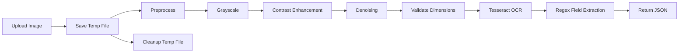

<!-- ============================================================ -->
<!--  AUTHDOC PYTHON OCR SERVICE — README                          -->
<!-- ============================================================ -->
<div align="center">

  <h1>AuthDoc Python OCR Service</h1>
  <p><b>FastAPI microservice for document OCR extraction using Tesseract and OpenCV.</b></p>

  <a href="https://fastapi.tiangolo.com/"></a>
  <a href="https://tesseract-ocr.github.io/"></a>
  <a href="https://www.python.org/"></a>

</div>

<br />

---

<br />

## Overview

The Python OCR service is a **stateless microservice** that receives document images (PDF, JPEG, PNG), preprocesses them for optimal OCR accuracy, and returns structured field data: UMIS numbers, GPA, CGPA, and per-subject grades.

### Responsibilities

| Component | Role |
| :--- | :--- |
| FastAPI server | HTTP endpoints for single and batch OCR |
| `extractor.py` | Tesseract OCR pipeline with image preprocessing |
| Image preprocessor | Contrast enhancement, denoising, validation |
| Field parser | Regex-based extraction of academic fields |

<br />

---

<br />

## Directory Structure

```text
backend/python/
├── main.py              # FastAPI app entry + routes
├── extractor.py         # Tesseract + OpenCV pipeline
├── requirements.txt     # Python dependencies
├── Dockerfile           # Multi-stage production build
├── .dockerignore
├── .env.example
└── .venv/               # Virtual environment (local)
```

<br />

---

<br />

## Quickstart

### Local Development

```bash
cd backend/python

# Create virtual environment
python -m venv .venv

# Activate (Windows)
.venv\Scripts\activate

# Activate (macOS/Linux)
source .venv/bin/activate

# Install dependencies
pip install -r requirements.txt

# Configure environment
cp .env.example .env
# Edit .env with your Tesseract path

# Start the server
uvicorn main:app --host 127.0.0.1 --port 8000 --reload
```

Service runs at `http://127.0.0.1:8000`.

### Docker

```bash
# Build image
docker build -t authdoc-ocr .

# Run container
docker run -p 8000:8000 authdoc-ocr
```

### Docker Compose (recommended)

From the project root:

```bash
docker compose up ocr
```

<br />

---

<br />

## Environment Variables

| Variable | Default | Required | Description |
| :--- | :--- | :--- | :--- |
| `PORT` | `8000` | No | Server listen port |
| `HOST` | `127.0.0.1` | No | Bind address (use `0.0.0.0` in Docker) |
| `TESSERACT_CMD` | _(system default)_ | No | Path to Tesseract binary |
| `LOG_LEVEL` | `INFO` | No | Logging verbosity |

<br />

---

<br />

## API Endpoints

### Health Checks

| Method | Endpoint | Response |
| :--- | :--- | :--- |
| GET | `/healthz` | `{ "status": "ok", "timestamp": "..." }` |
| GET | `/readyz` | `{ "status": "ready" }` |

### OCR Extraction

| Method | Endpoint | Body | Response |
| :--- | :--- | :--- | :--- |
| POST | `/extract` | `multipart/form-data` (`file`) | `{ umis_no, gpa, cgpa, subject_grades }` |
| POST | `/extract/batch` | `multipart/form-data` (`files[]`) | `{ count, documents: [...] }` |

### Response Schema

```json
{
  "umis_no": "2403732210421149",
  "subject_grades": [
    { "code": "22CSC02", "grade": "B" },
    { "code": "22CSC03", "grade": "C" }
  ],
  "gpa": 8.5,
  "cgpa": 8.2
}
```

**Field semantics:**
- `umis_no`: Student unique identifier (string or null)
- `subject_grades`: Array of extracted subject-grade pairs
- `gpa`: Grade Point Average (float or null)
- `cgpa`: Cumulative GPA (float, `"WITHHELD"`, or null)

<br />

---

<br />

## OCR Pipeline



### Preprocessing Steps

1. **Grayscale conversion** — Reduces color noise
2. **Contrast enhancement** — 2.5x via PIL `ImageEnhance`
3. **Denoising** — OpenCV `fastNlMeansDenoising` (h=20, template=7, search=21)
4. **Dimension validation** — Rejects images smaller than 800x1000px
5. **OCR** — Tesseract with `--oem 3 --psm 6` (LSTM engine, uniform text block)
6. **Regex extraction** — Pattern matching for UMIS, GPA, CGPA, subjects

<br />

---

<br />

## Dependencies

| Package | Version | Purpose |
| :--- | :--- | :--- |
| `fastapi` | latest | Async HTTP framework |
| `uvicorn` | latest | ASGI server |
| `pytesseract` | latest | Python wrapper for Tesseract OCR |
| `pillow` | latest | Image preprocessing (contrast, format) |
| `opencv-python-headless` | latest | Image denoising and manipulation |
| `python-multipart` | latest | File upload support for FastAPI |

> [!NOTE]
> `opencv-python-headless` is used instead of `opencv-python` to avoid GUI dependencies in Docker/server environments.

<br />

---

<br />

## Production Notes

- **Stateless**: No in-memory state; each request is independent
- **Temp file safety**: All uploaded files are cleaned up in `finally` blocks
- **Non-root container**: Docker image runs as `appuser`
- **Health probes**: `/healthz` and `/readyz` configured for orchestration
- **Graceful scaling**: Uvicorn runs with `--workers 2` in Docker

<br />

---

<br />

<div align="center">
  <sub>Part of the <a href="../README.md">AuthDoc</a> platform</sub>
</div>
