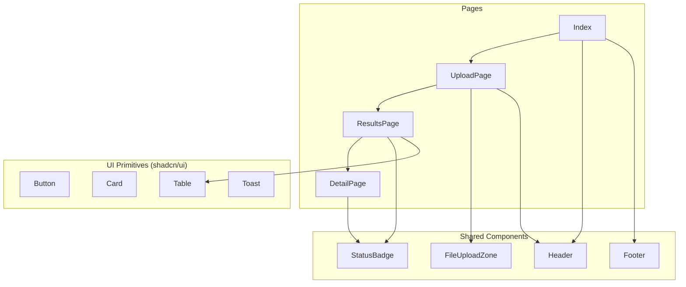

<!-- ============================================================ -->
<!--  AUTHDOC FRONTEND — README                                    -->
<!-- ============================================================ -->
<div align="center">

  <h1>AuthDoc Frontend</h1>
  <p><b>React SPA for document upload, batch verification, and field-level audit results.</b></p>

  <a href="https://react.dev/"></a>
  <a href="https://www.typescriptlang.org/"></a>
  <a href="https://vitejs.dev/"></a>
  <a href="https://tailwindcss.com/"></a>

</div>

<br />

---

<br />

## Overview

The frontend is a **single-page application** built with React 18, TypeScript, Vite, and shadcn/ui. It provides a clean, verification-focused interface for uploading academic documents, viewing batch results, and inspecting field-level verification details with full explainability.

### Responsibilities

| Component | Role |
| :--- | :--- |
| React SPA | Client-side routing and state management |
| shadcn/ui | Accessible, composable UI primitives |
| API client (`lib/api.ts`) | Typed fetch wrapper for backend endpoints |
| Vite | Fast dev server with HMR and optimized builds |
| Tailwind CSS | Utility-first styling with design tokens |

<br />

---

<br />

## Directory Structure

```text
frontend/
├── public/                        # Static assets
├── src/
│   ├── components/
│   │   ├── ui/                   # shadcn/ui primitives (50+ components)
│   │   ├── Header.tsx            # Navigation header
│   │   ├── Footer.tsx            # Page footer
│   │   ├── FileUploadZone.tsx    # Drag-and-drop upload area
│   │   ├── StatusBadge.tsx       # Verification status indicator
│   │   ├── ProcessStep.tsx       # Landing page process card
│   │   ├── FeatureItem.tsx       # Landing page feature card
│   │   └── StatsCard.tsx         # Stats display
│   ├── pages/
│   │   ├── Index.tsx             # Landing page
│   │   ├── UploadPage.tsx        # Batch document upload
│   │   ├── ResultsPage.tsx       # Batch verification table
│   │   ├── DetailPage.tsx        # Single document detail view
│   │   └── NotFound.tsx          # 404 catch-all
│   ├── lib/
│   │   ├── api.ts                # API client (typed fetch)
│   │   └── utils.ts              # Utility functions
│   ├── hooks/
│   │   ├── use-toast.ts          # Toast notifications
│   │   └── use-mobile.tsx        # Responsive breakpoint hook
│   ├── App.tsx                   # Router configuration
│   ├── main.tsx                  # DOM mount point
│   └── index.css                 # Design system tokens (HSL)
├── nginx.conf                    # Production Nginx config
├── Dockerfile                    # Multi-stage production build
├── .dockerignore
├── .env.example
├── tailwind.config.ts
├── vite.config.ts
├── vitest.config.ts
├── eslint.config.js
├── tsconfig.json
├── package.json
└── package-lock.json
```

<br />

---

<br />

## Pages & Routes

| Route | Component | Description |
| :--- | :--- | :--- |
| `/` | `Index.tsx` | Landing page with process steps and feature overview |
| `/upload` | `UploadPage.tsx` | Drag-and-drop batch document upload |
| `/results` | `ResultsPage.tsx` | Batch verification results table |
| `/results/:documentId` | `DetailPage.tsx` | Field-level verification detail with explainability |
| `*` | `NotFound.tsx` | 404 catch-all |

<br />

---

<br />

## Quickstart

### Local Development

```bash
cd frontend

# Install dependencies
pnpm install

# Configure environment
cp .env.example .env
# Edit .env if backend runs on a different port

# Start dev server
pnpm dev
```

Frontend runs at `http://localhost:8080`.

### Docker

```bash
# Build image
docker build -t authdoc-frontend .

# Run container
docker run -p 8080:80 authdoc-frontend
```

### Docker Compose (recommended)

From the project root:

```bash
docker compose up frontend
```

<br />

---

<br />

## Environment Variables

| Variable | Default | Description |
| :--- | :--- | :--- |
| `VITE_API_BASE_URL` | `http://localhost:3000/api` | Node.js API base URL |

> [!NOTE]
> Vite environment variables are embedded at build time. For production, update `src/lib/api.ts` or rebuild with the correct `VITE_API_BASE_URL`.

<br />

---

<br />

## Scripts

| Command | Description |
| :--- | :--- |
| `pnpm dev` | Start Vite dev server with HMR |
| `pnpm build` | Production build to `dist/` |
| `pnpm preview` | Preview production build locally |
| `pnpm lint` | Run ESLint |
| `pnpm test` | Run Vitest (single run) |
| `pnpm test:watch` | Run Vitest in watch mode |

<br />

---

<br />

## UI Architecture



<br />

---

<br />

## Tech Stack

| Technology | Purpose |
| :--- | :--- |
| React 18 | UI framework with hooks and concurrent features |
| TypeScript 5 | Type safety across all components and API calls |
| Vite 5 | Fast build tool with SWC-based React transform |
| Tailwind CSS 3 | Utility-first styling with CSS custom properties |
| shadcn/ui | 50+ accessible primitives (Radix UI + Tailwind) |
| React Router 6 | Client-side routing with nested routes |
| TanStack Query | Server state management and caching |
| Zod | Schema validation for forms and API responses |
| Vitest | Unit testing framework |
| ESLint | Code quality and consistency |

<br />

---

<br />

## Production Build

The Docker image uses a **two-stage build**:

1. **Builder stage**: Installs dependencies, runs `pnpm build`
2. **Runtime stage**: Copies `dist/` into Nginx Alpine with a custom config

### Nginx Configuration

- **SPA routing**: All routes fallback to `index.html`
- **Gzip compression**: Enabled for text, JS, CSS, JSON, SVG
- **Asset caching**: `/assets/` served with 1-year cache + immutable
- **Security headers**: X-Content-Type-Options, X-Frame-Options, etc.
- **Health check**: `/healthz` returns JSON status

<br />

---

<br />

## Design System

The frontend uses a custom HSL-based design token system defined in `src/index.css`:

| Token | Light | Dark | Usage |
| :--- | :--- | :--- | :--- |
| `--primary` | `217 91% 60%` | `217 91% 60%` | Brand blue (trust) |
| `--verified` | `142 76% 36%` | `142 76% 45%` | Success status |
| `--flagged` | `38 92% 50%` | `38 92% 50%` | Warning status |
| `--missing` | `220 10% 50%` | `220 10% 50%` | Neutral status |

Dark mode is supported via the `.dark` class on the root element.

<br />

---

<br />

## Key Features

- **Drag-and-drop upload** — Select multiple PDF/image files at once
- **Batch processing** — Upload 1-10 documents in a single flow
- **Real-time status** — Toast notifications for upload and verification progress
- **Field-level detail** — Every field shows extracted value, status, and reason
- **Responsive** — Mobile-first design with Tailwind breakpoints
- **Dark mode** — Full dark theme support via CSS custom properties
- **Accessible** — Built on Radix UI primitives with ARIA compliance

<br />

---

<br />

<div align="center">
  <sub>Part of the <a href="../README.md">AuthDoc</a> platform</sub>
</div>
